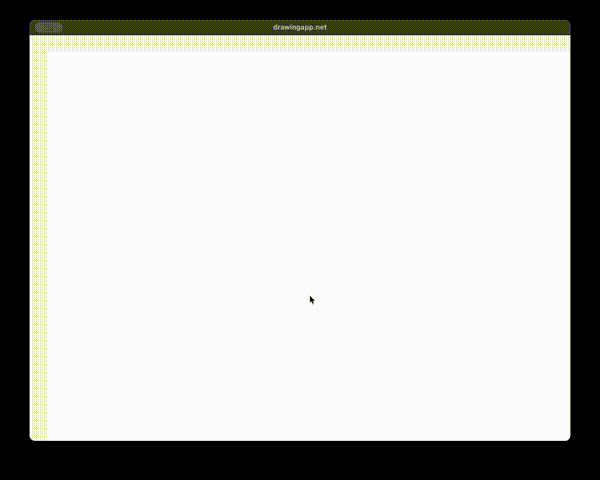

# drawingapp.net

A simple, lightweight drawing app for Mac, Windows, and Linux.

> **Status**: 🚧 Early development (v0.0.1) - Not yet released


## Tech Stack

- **Language**: C# (.NET 10)
- **UI Framework**: [Avalonia UI](https://avaloniaui.net) 12.x
- **Graphics**: SkiaSharp (Skia)

## Building from Source

```bash
git clone https://github.com/catedt/drawingapp.net.git
cd drawingapp.net
dotnet run
```

Requires .NET 10 SDK.

## License

This project is licensed under the **PolyForm Noncommercial License 1.0.0**.

- [v] Free for personal, educational, and non-commercial use
- [v] Free for non-profit organizations
- [v] Free to study, modify, and contribute
- [-] Commercial use requires a paid license
- [-] Redistribution of compiled builds is not permitted

For commercial licensing: catedt@gmail.com

Pre-built binaries (when available) will be sold via:
- Microsoft Store (Windows)
- Lemon Squeezy (Mac/Linux)

See [LICENSE](LICENSE) for full terms.

## Contributing

Contributions welcome! By contributing, you agree to license your contributions under the same PolyForm Noncommercial License, and grant the project owner the right to use your contributions in commercial distributions.

## Author

[catedt] - [catedt@gmail.com]

## Demo
